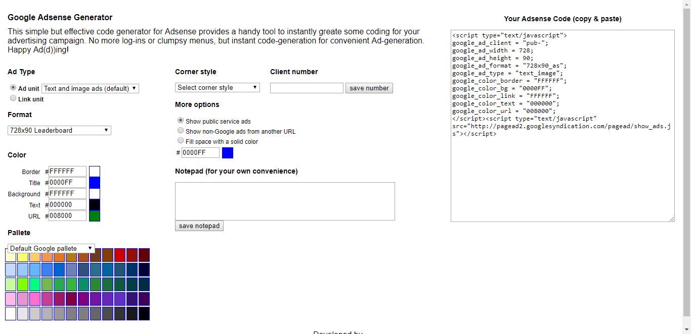

# Adsense Generator

_This simple but effective code generator for Adsense provides a handy tool to instantly greate some coding for your advertising campaign. No more log-ins or clumpsy menus, but instant code-generation for convenient Ad-generation. Happy Ad(d))ing!_

Back in 2008 there was a website hosted on adsense-generator.com that would easily let you generate advertisement blocks for your webpages but now nearly 10 years later this website has gone long extinct. However the internet does not forget. I managed to pull the page from a cache service website (I think Google cache or that wayback thing), isolated only the required HTML, Javascript and css styles and saved them as a repository. I made *no changes* to the code which is why it is so crappy.

*Note*: the color picker is buggy. Fix it, send me a pull request and I will merge it.

*Note*: while the old Adsense code blocks are still supported by Google, these days it is better to use their new system and create ad units from within your account. For more information read https://support.google.com/adsense/answer/6330564?hl=en or login to your account.